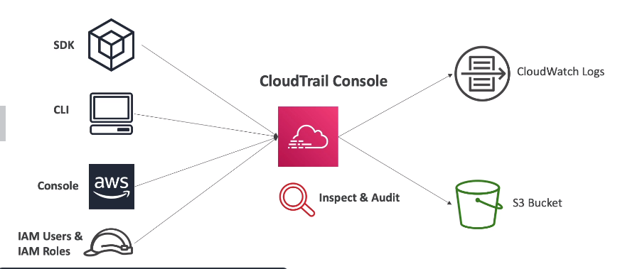
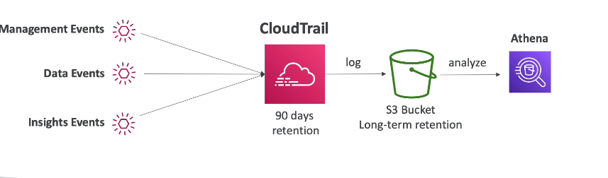

# AWS CloudTrail

- Provides governance, compliance and audit for your AWS Account
- Enabled by default
- Get an history of events / API calls made within your AWS account by:
  - Console
  - SDK
  - CLI
  - AWS services
- Can put logs from CloudTrail into CLoudWatch logs or S3
- A trail can be applied to All regions (default) or a single Region.
- If a resource is deleted in AWS, investigate CloudTrail first

## CloudTrail Events

- **Management Events**:
   - Operations that are performed on resources in your AWS account
   - Examples:
       - Configure security (IAM AttachRolePolicy)
       - Configuring rules for routing data (Amazon EC2 CreateSubnet)
       - Setting up logging (AWS CloudTrail CreateTrail)
   -  **By default, trails are configuted to log management events
   - Can seperate **Read Events** (that don't modify resources) from **Write Events** (that may modify resources)

- **Data Events**:
    - **By default, data events are not logged (because high volume operations)**
    - Amazon S3 object-level activity (ex. GetOjbect, DeleteObject, PutObject): can seperate Read and Write events
    - AWS lambda function execution activity (the **Invoke** API)

- **CloudTrail Insights**

## CloudTrail Insights

- Enable **CloudTrail Insights to detect unusual activity** in your account
   - inaccurate resource provisioning
   - hitting service limits
   - bursts of AWS IAM actions
   - gaps in periodic maintenance activity
- CloudTrail Insights analyzes normal management events to create a baseline
- And then **continuously analyzes write events to detect unusual patterns**
   - Anamolies appear in the CloudTrail console
   - Event is sent to Amazon S3
   - An EventBridge event is generated (for automation needs)

## CloudTrail Events Retention

- Events are stored for 90 days in CloudTrail
- To keep events beyond this period, log them to S3 and use Athena (for auditing purposes for example)

