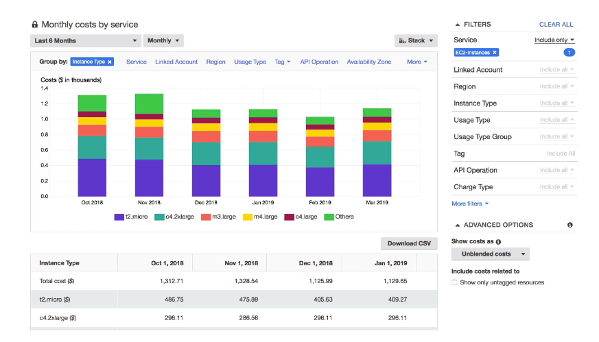
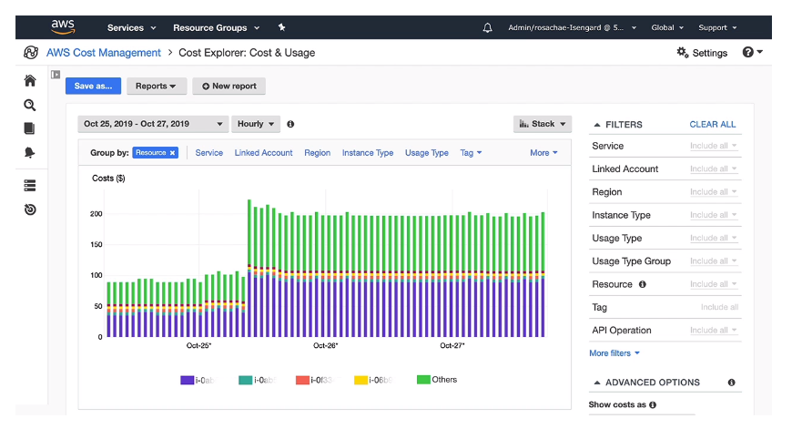
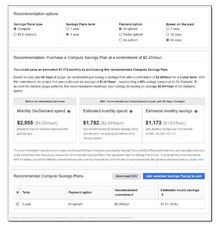
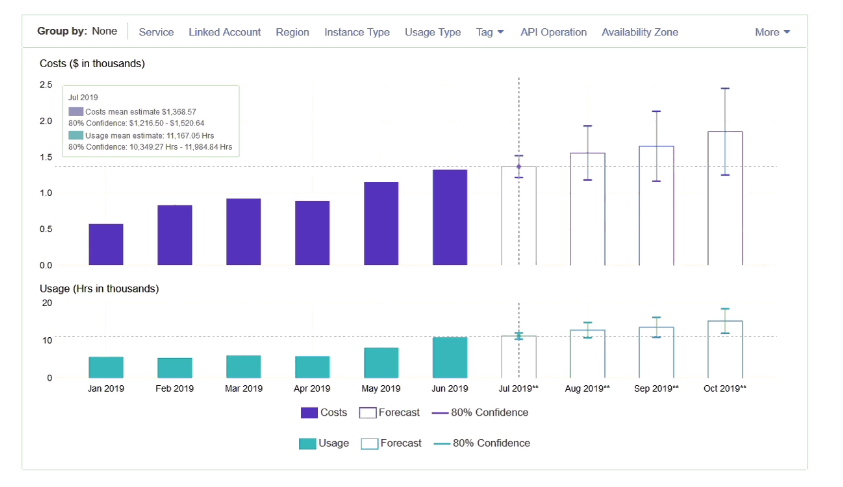

# Cost Explorer

- Visualize, understand, and manage your AWS costs and usage over time
- Create custom reports that analyze cost and usage data
- Analyze your data at a high level: total costs and usage across all accounts
- Or monthly, hourly, resource level granularity

- Choose an optimal **Savings Plan** (to lower prices on your bill)

- **Forecast usage up to 12 months based on previous usage**

## Cost Explorer - Monthly Cost by AWS Service

## Cost Explorer - Hourly & Resource Level

## Cost Explorer - Savings Plan Alternative to Reserved Instances

## Cost Explorer - Forecast Usage

